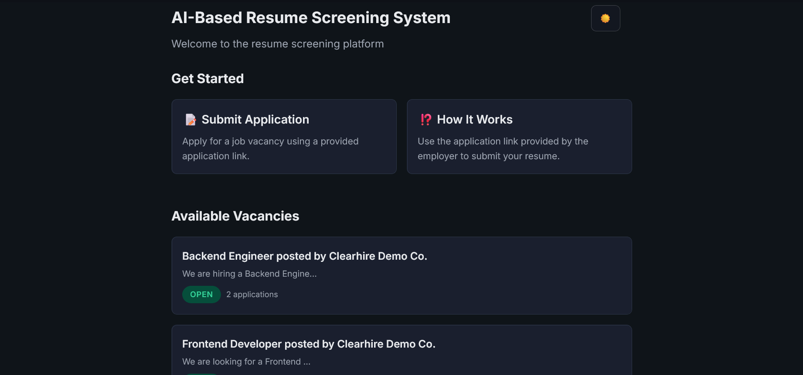
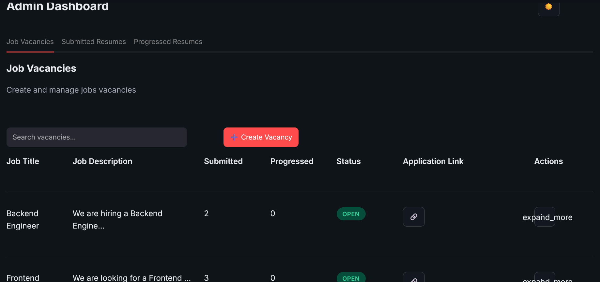
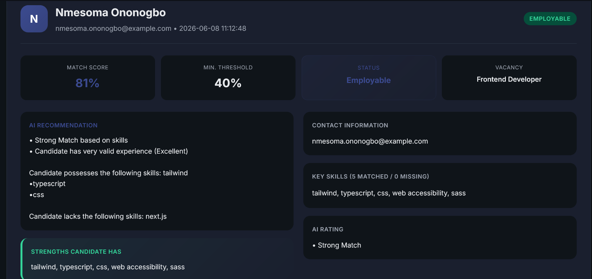
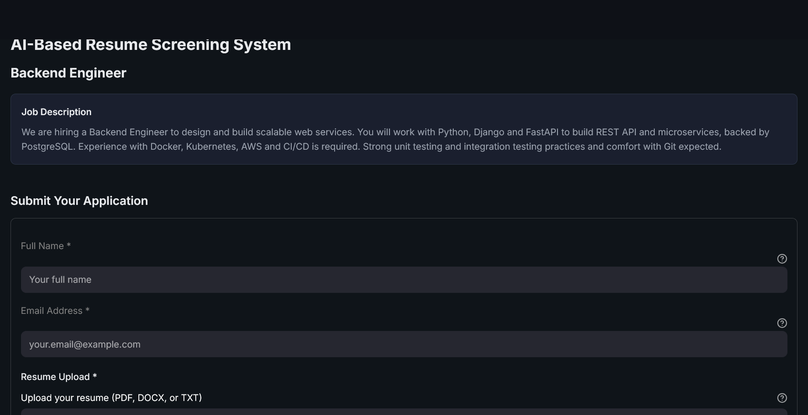

# Clearhire

**An AI-assisted resume screening platform that ranks candidates on skills and experience — and anonymizes personal information before scoring to reduce hiring bias.**

[](https://streamlit.io/)
[](https://www.python.org/)

🔗 **Live demo:** _<add your Streamlit Cloud URL here>_



---

## What it does

Clearhire helps employers screen job applications faster and more fairly. An employer posts a vacancy and shares a unique application link. Candidates apply with their resume, and Clearhire automatically scores each resume against the job, analysing **skills**, **experience**, and overall **content relevance**, then presents ranked candidates to the hiring team in a clean dashboard.

Unlike a naive keyword filter, Clearhire is built with **responsible screening** in mind: it strips personally identifiable information (name, email, phone) from each resume *before* the scoring engine ever sees it, so decisions are driven by qualifications rather than identity.

## Why it's different

- 🛡️ **Bias-aware by design** — resumes are anonymized before scoring; demographic data, when collected, is for diversity reporting only and never feeds the algorithm.
- 🎯 **Transparent scoring** — every candidate gets a match score plus a plain-language explanation of strengths and gaps. No black box.
- 🧩 **Configurable for any field** — ships tuned for tech roles, but the skill engine is domain-agnostic: a bank, hospital, or law firm can adapt it by editing one config file.
- 📊 **Clean hiring workflow** — vacancies → submitted applications → progressed candidates → interview invitations, all in one dashboard.

---

## Screenshots

| Admin dashboard | Candidate detail & AI explanation |
|---|---|
|  |  |
<!-- admin-dashboard.png = Job Vacancies overview; submission-detail.png = a scored candidate -->

**Candidate application form**



---

## How the scoring works

Each resume is scored on three signals, then combined into a single match percentage:

| Signal | Weight | What it measures |
|---|---|---|
| **Experience** | 40% | Years of relevant experience detected in the resume |
| **Skills match** | 30% | Share of the job's required skills found in the resume (strict, whole-word matching) |
| **Content similarity** | 30% | Overall textual relevance between resume and job description (TF-IDF + cosine similarity) |

A candidate with no overlapping skills is flagged immediately rather than given a misleading partial score. Results are bucketed into **Employable / Fair / Not employable** relative to a per-vacancy threshold the employer sets.

---

## Tech stack

- **Frontend & app framework:** Streamlit (multi-page)
- **Scoring:** scikit-learn (TF-IDF, cosine similarity), custom skills & experience matchers
- **Database:** SQLite
- **Resume parsing:** pdfplumber, python-docx
- **Email:** SMTP (interview invitations)

---

## Getting started

```bash
# 1. Clone
git clone https://github.com/dev-omafrank/clearhire.git
cd clearhire

# 2. Create a virtual environment
python -m venv .venv
source .venv/Scripts/activate      # Windows (Git Bash)
# source .venv/bin/activate        # macOS / Linux

# 3. Install dependencies
pip install -r requirements.txt

# 4. Configure environment variables
cp .env.example .env
# edit .env and add your SMTP credentials (only needed for interview emails)

# 5. Seed the demo data (synthetic resumes + sample vacancies)
python seed_demo.py

# 6. Run the app
streamlit run app.py
```

The app opens at `http://localhost:8501`. The **Admin Dashboard** is at the `admin` page; the candidate-facing application form is reached via a vacancy's application link.

> **Note:** `seed_demo.py` loads five synthetic resumes and two sample vacancies so the app is populated out of the box. All demo data is fabricated — no real candidate information is included.

---

## Configuring for a different industry

Clearhire ships configured for software/tech roles, but the matching engine is not tech-specific. Skills are grouped by domain in [`src/config/skills_data.py`](src/config/skills_data.py):

```python
ACTIVE_DOMAINS = [
    "software_engineering",
    "web_development",
    "data_ai",
    "cloud_devops",
]
```

To screen for a different field, add a domain (e.g. `"banking"`, `"healthcare"`) to `SKILL_DOMAINS` and list it in `ACTIVE_DOMAINS`. Nothing else needs to change — this makes Clearhire straightforward to deploy as a custom screening tool for non-tech employers.

---

## Engineering decisions

A few deliberate choices worth calling out for technical readers:

- **Anonymize before scoring, not after.** PII redaction (name, email, phone, URLs) happens on the resume text *before* it reaches the scoring functions, so identity genuinely cannot influence the score. The original file is preserved on disk for the human reviewer.
- **Strict, whole-word skill matching.** Skills use word-boundary regex and unambiguous names (`golang`, not `go`) to avoid false positives like matching "go" inside "category." This trades a little recall for much higher precision — appropriate when a false skill match can unfairly inflate a score.
- **A single source of truth for status.** Candidate status (Employable / Fair / Not employable) is computed by one function used everywhere — dashboard badges, filters, and detail views — so the labels can never drift out of sync.
- **Domain-grouped, config-driven skills.** Keeping skills in a configurable structure (rather than one hardcoded list) is what makes the system reusable across industries without code changes.
- **Real scores in the demo.** `seed_demo.py` runs the actual production scoring pipeline rather than inserting hardcoded numbers, so the demo reflects genuine behaviour.

## Responsible AI & limitations

Clearhire is a **decision-support** tool, not an autonomous gatekeeper — final hiring decisions should always involve a human. Known limitations and intended next steps:

- TF-IDF captures keyword relevance but not semantic meaning; embedding-based similarity would catch paraphrased experience.
- Experience detection is pattern-based and works best on conventionally formatted resumes.
- Before handling real candidate data in production, the system would need authentication/access control, audit logging, and encryption at rest.

---

## Author

**Nmesoma Ononogbo** — [github.com/dev-omafrank](https://github.com/dev-omafrank)

_Clearhire is an independent project built to explore fair, explainable automation in hiring._
